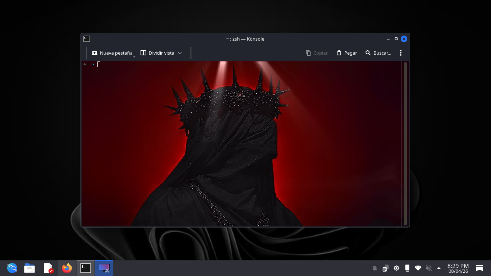

# OcyShield-Framework
Advanced Android Auditing & Penetration Testing Environment

## Overview
OcyShield is a modular framework engineered for security researchers and penetration testers to conduct comprehensive audits on Android infrastructure. The platform streamlines the deployment of diagnostic payloads, command-and-control (C2) session management, and advanced signature evasion.

## Core Features
* **Dynamic Payload Deployment:** Optimized stubs designed for mobile security auditing.
* **Ghost Mode:** Implementation of advanced obfuscation techniques to bypass static analysis and heuristic detection.
* **C2 Interface:** A low-latency handler for real-time remote diagnostics and command execution.
* **Automated Dependency Resolution:** Integrated environment configuration for Unix-based systems.

## Installation
To install **OcyShield** globally with a single command, run:

curl -sSL [https://raw.githubusercontent.com/ocytos/OcyShield-Framework/main/install.sh](https://raw.githubusercontent.com/ocytos/OcyShield-Framework/main/install.sh) | bash

## Usage
To initialize the framework's core interface, run:

ocysh

## Legal Disclaimer
**FOR EDUCATIONAL AND AUTHORIZED ETHICAL TESTING PURPOSES ONLY.**

The use of OcyShield-Framework for attacking targets without prior mutual consent is strictly illegal. It is the end user's sole responsibility to comply with all applicable local, state, and federal laws. The developer assumes no liability and is not responsible for any misuse, systemic damage, or data loss caused by this software. 

By utilizing this framework, you agree to operate strictly within the scope of authorized security engagements.
EOF

